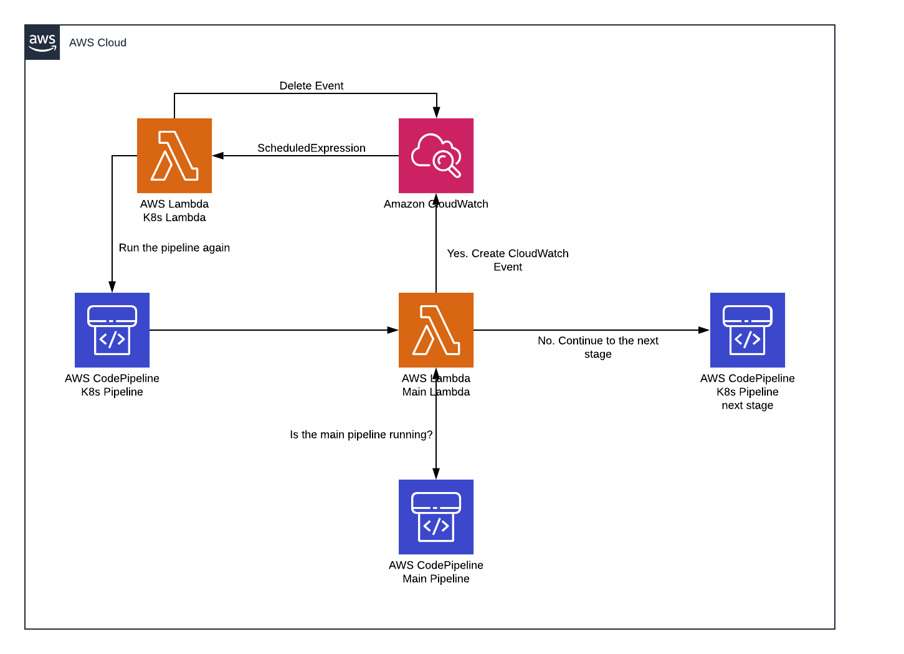

# Use AWS Lambda to create CI/CD dependencies with Code Pipeline

At Sentia we like to make the everybody’s lives easier, by trying to fully automate our solutions. We are using a lot of tools and services to do so, including AWS CDK and AWS CodePipeline. When we started to offer Kubernetes solutions to our customers, one CodePipeline pipeline was not enough to do the job, because one pipeline with multiple purposes will add complexity to the solution and it will create unwanted dependencies.  

Separating the pipelines per purpose, will remove complexity from the pipeline design, will create separate processes and will decouple the components, will be easier to debug, and it will improve the change process by only changing the part you need. 

In our case, we wanted to separate the infrastructure changes and deployments, from the applications (pods) deployments for K8s, because we want to have all the infrastructure up to date with the latest changes, before we deploy the application. And, if the only modification made is at the application level, there is no need to update the infrastructure as well. This of course, has come with some challenges, and I am happy to share with you how we overcome those challenges and how our solution looks today. 

Although having different pipelines for different purposes brings many benefits, it does come with some challenges as well. The main challenge is managing all the pipelines. This is because some of them will require more time to run, and some of them will require less. And, usually when this happens, you might need them to run in a specific order, so the result of one pipeline can be used as an input for the next one, and so on. In order to obtain this, some pipeline dependencies need to be created. In order to do so, in a professional and cost-effective manner, following the recommended best practices from AWS, leads us to using AWS Lambda functions. 

Back to our case, we have the main pipeline, the one responsible for deploying all the underlying infrastructure, that is more time to complete than the K8s pipeline, the one used for the pods deployment. The first one is responsible for updates of the underlying infrastructure, including K8s infrastructure, and it should finish to update successfully, all the stages before the second one starts running. This way, the K8s pipeline will have the latest updates on the infrastructure and can run safely. To be clear, both pipelines are running in the same account.  

The plan is to create a new stage in the K8s pipeline and add an action to trigger one lambda function. This first lambda function is the main lambda and will be responsible to check if the main pipeline is running, and if it isn’t running, let the process continue.  

But if the main pipeline is running, it will trigger a CloudWatch Event that will have another lambda function as a target, let’s called it K8s Lambda. The CloudWatch Event will have a rule that is being triggered by a scheduled expression in 5 minutes after it was called and it has as target, the K8s Lambda function. This function will have as scope to first delete the event, and then to trigger the K8s pipeline. In order to delete the event, it must first delete the events targets. 

These checks will be done until the main pipeline has finished running (first scenario is being valid), and the Main Lambda will allow: the stage to be validated and the CodePipeline to move to the next stage in the K8s pipeline. 

The decision tree looks like this: 

Having separate pipelines for different purposes, simplifies any complex solution and brings automation and flexibility to it. You can now achieve decoupled infrastructure, simplified debug process, more control over the changes, to run only what you need, when you need it. As any change, this comes with some challenges. But when you have the right tools and some creativity, these challenges can be transformed in great solutions for the future. 