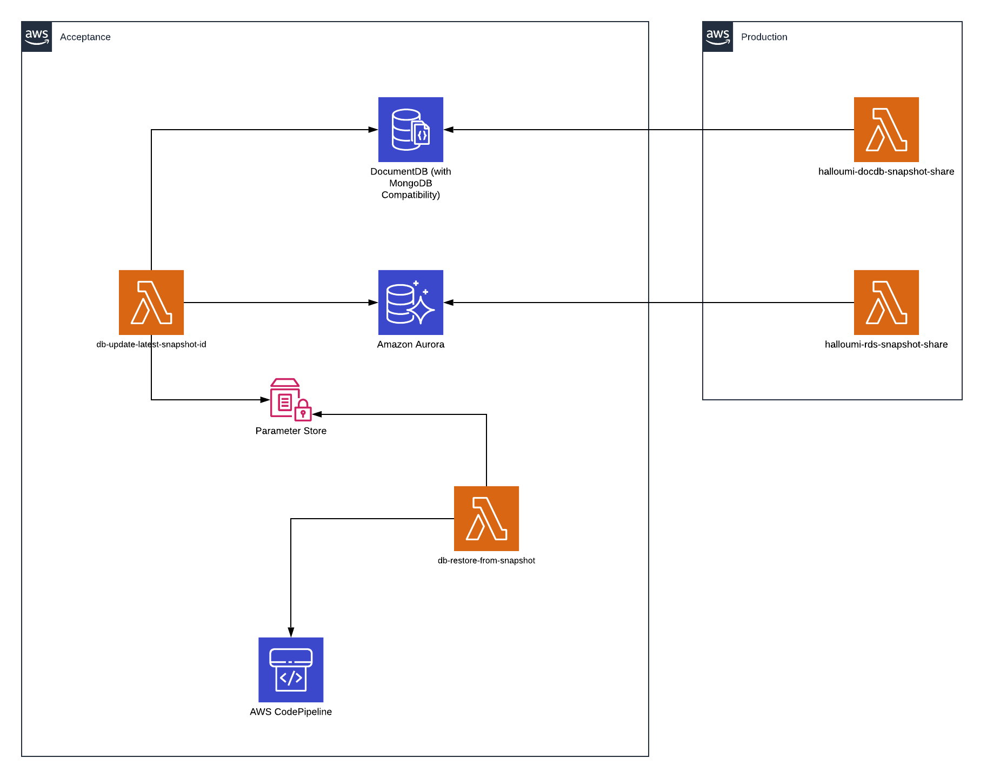

# Automated database update and restore with AWS Lambda functions for AWS Aurora

The roadmap to cloud adoption can be difficult to set and implement, but once it is completed it offers a lot of flexibility, a lot of space for continuous improvement and a lot of room for creativity to build new solutions.
Having automated processes helps the company to focus on what is important for the business and lets the developers experiment more and efficiently optimize their work. 
One of the latest things I've been working on involves a task that needed to be continued after the client's solution was already moved to the cloud. What I liked about it was that it is not only taking the advantage of being in the cloud, it also involves serverless technology that I consider to be the next level of cloud solutions. The task involved both AWS Aurora and AWS DocumentDB databases, and I will make a separate article about the second one since there are some differences to be presented and discussed.

## Scenario
Our customer has 2 different AWS accounts:
 * Acceptance
 * Production

All changes made in the production account should be (every two weeks) synchronised to their acceptance account for regression testing in the acceptance account.
The old way of doing this with the on-prem infrastructure was to manually run some commands and update the databases.
The process should be done in the maintenance window, which implies working in the night/early morning when nobody is using the databases.

## Solution overview
The solution we agreed on was to split the process in 2 main parts having 2 AWS Lambda functions:
 * first one, *db-update-latest-snapshot-id*, will mainly focus on preparing the environment:
    - check the latest shared snapshot for Aurora
    - update the latest snapshot id parameter in AWS SSM Parameter Store 
 * the second one, *db-restore-from-snapshot*, will mainly focus on triggering the update and restore process:
    - will copy the latest snapshot ID value to the current snapshot ID and then trigger the main pipeline to deploy the changes and restore the database from the latest snapshots
I took advantage of the already existing AWS Lambda functions that are sharing the database snapshots from one account to the other. The sharing part is not in the scope of this article but it was illustrated for a better view of the solution.

In AWS SSM Parameter Store, I have created 3 parameters:

 * ssm_rds_current_snapshot_name
 * ssm_rds_latest_snapshot_name
 * main_cicd_name

The current value will be the one from which the database is restored from and the latest value will be the value of the most recent snapshot that exists in the account.
We need to have 2 different parameters, one for the current and one for the latest snapshot, to be able to restore the database from a specific snapshot ID outside of this process and not directly trigger a restore when the pipeline is running but restore on a pre-defined time/date.
There are 2 pipeline in the account, so the name of the main pipeline, the one that is deploying the infrastructure, was needed.

The entire solution was written using IaC in AWS CDK with Python.



## How does it work
First lets look at how the parameters are defined in code. We have been using environment variables and a custom function that gets the environment variable value *get_optional*. There is an existing process of restoring the database from a specific snapshot ARN from the environment variables, and this is why we use the check for the *current_rds_backup_snapshot* parameter. If it exists it will update the parameter with this value. For the *ssm_rds_latest_snapshot_name* a dummy value was used because you can't create an SSM parameter with an empty value. 

```Python
current_rds_backup_snapshot = get_optional(
    'DATABASE_BACKUP_SNAPSHOT_ID_ARN',
    None
)

ssm_rds_current_snapshot_name = get_optional(
    'SSM_RDS_CURRENT_SNAPSHOT_NAME',
    None
)

ssm_rds_latest_snapshot_name = get_optional(
    'SSM_RDS_LATEST_SNAPSHOT_NAME',
    None
)

main_cicd_name = get_optional(
    'SSM_MAIN_CICD_NAME',
    None
)

resources = []
if current_rds_backup_snapshot:
    current_arn = ssm.StringParameter(
        scope,
        f'{config["stack_name"]}RdsCurrentSnapshotArn',
        parameter_name=ssm_rds_current_snapshot_name,
        string_value=current_rds_backup_snapshot
    )
    resources.append(current_arn.parameter_arn)

rds_ssm = ssm.StringParameter(
    scope,
    f'{config["stack_name"]}RdsLatestSnapshotArn',
    parameter_name=ssm_rds_latest_snapshot_name,
    string_value='dummyvalue'
)
resources.append(rds_ssm.parameter_arn)

main_cicd_ssm = ssm.StringParameter.from_string_parameter_name(
    scope,
    f'{config["stack_name"]}MainPipelineName',
    string_parameter_name=main_cicd_name,
)
main_cicd_name_value = main_cicd_ssm.string_value
resources.append(main_cicd_ssm.parameter_arn)
resources.append(f'arn:aws:codepipeline:*:*:{main_cicd_name_value}')
```

Using a cronjob the update function (*db-update-latest-snapshot-id*) will run every 2 weeks at 2 AM.
This function has the following tasks/functions:

* *get_latest_rds_snapshots* - checks for the latest shared snapshot for Aurora DB and it gets the latest one.

* *update_ssm* - it will update the SSM Parameter store with the new values of the latest snapshots in in *aurora_latest_snapshot_id*.

And this is it for the update process.
Now for the restore is even simpler. Using another cronjob the restore function  (*db-restore-from-snapshot*) will run every 2 weeks, 2 hours later than the update process.
The tasks of this functions are:

* *update_current* - it gets the value from the latest parameters and copies it to the current one. Now the value of the *ssm_rds_current_snapshot_name* will be updated with the value of *ssm_rds_latest_snapshot_name*. The pipeline will check the value of the current parameters. We have split this process with latest and current parameters to facilitate the restore from a snapshot in other cases than the ones described in this article as menioned above.

* trigger the deployment pipeline using the *main_cicd_name* from the SSM Parameter Store

    ```Python
    # Trigger a new pipeline deployment
        cicd_client.start_pipeline_execution(
            name=cicd_name
        )
    ```

## Small bumps
The process of finding out a solution was challenging in each phase of implementation. At the beginning we tried to find a solution that will come on top of the existing one and work to improve it. In the process of implementing the solution with Lambda functions there was the problem of identifying the exact snapshot we need, which of course was just a matter of knowing what you want to extract and reading the documentation. For example, the process of checking the available shared snapshot is looking like this:

```Python
rds_shared_snapshots = rds_client.describe_db_cluster_snapshots(
        SnapshotType='shared',
        IncludeShared=True
    )

    # Check available RDS shared snapshots from the source account
    rds_snapshots_source = []
    for snap in rds_shared_snapshots['DBClusterSnapshots']:
        source_account_id = snap['DBClusterSnapshotIdentifier'].split(':')[4]
        if snap['Status'] == 'available' and \
           source_account_id == source_account and \
           snap['EngineVersion'] == rds_engine_version:
            rds_snapshots_source.append(snap)
```

So we had to select from all the snapshots the ones that are having a specific source account ID, that are available and that are specific for Aurora engine (MySQL or PostgreSQL).
## Conclusion
Even with the small bumps we had, this solution is pretty easy to implement in the AWS cloud. The solution not only saves time and money, but also protects the environment against the human errors that can easily happen at that time at night when databases operations are implemented. With the manual task out of the way the developers can focus on other important tasks and also on bringing more automation to the solution as well. Stay tunned for the DocumentDB scenario to see what are the differences and how can you make it work.