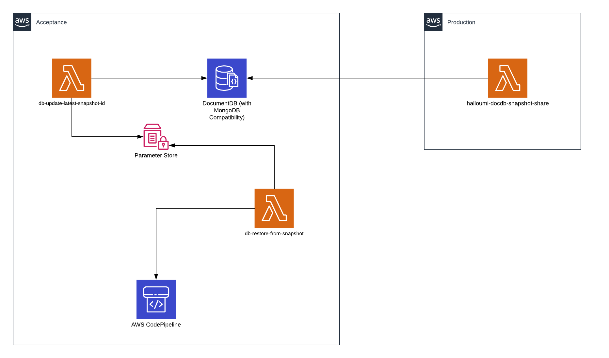

# Automated database update and restore with AWS Lambda functions for AWS DocumentDB

In my previous article I talked about my last challenge, namely the automation of an update and restore process for the solution that was already migrated to the cloud. We discussed there the advantages of cloud adoption and we have focused on the Aurora DB. We will discuss in this article how we have reused the same solution and what modifications we have made to make it suitable for DocumentDB, because another great thing about the cloud is that we can reuse and adapt solutions to meet different requirements easly.

Amazon DocumentDB has MongoDB compatibility and "is a database service that is purpose-built for JSON data management at scale, fully managed and integrated with AWS, and enterprise-ready with high durability." as AWS states in the official documentation.

## Scenario (recap)
Our customer has 2 different AWS accounts:
 * Acceptance
 * Production

 All changes made in the production account should be (every two weeks) synchronised to their acceptance account for regression testing in the acceptance account.
The old way of doing this with the on-prem infrastructure was to manually run some commands and update the databases.
The process should be done in the maintenance window, which implies working in the night/early morning when nobody is using the databases.
The big advantage of having the solution in the cloud is that it can easly be automated using services that bring low or no cost at all, and that this solution needs no human interaction.

## Solution overview (recap)
The solution we agreed on was to split the process in 2 main parts having 2 AWS Lambda functions:
 * first one, *db-update-latest-snapshot-id*, will mainly focus on preparing the environment:
    - copy the shared DocumentDB snapshot (because we can’t restore from it directly, see [this](https://docs.aws.amazon.com/documentdb/latest/developerguide/backup_restore-share_cluster_snapshots.html) article)
    - check the latest copied snapshot for DocumentDB
    - update the latest snapshot id parameters in AWS SSM Parameter Store 
 * the second one, *db-restore-from-snapshot*, will mainly focus on triggering the update and restore process:
    - will copy the latest snapshot ID value to the current snapshot ID and then trigger the main pipeline to deploy the changes and restore the databasess from the latest snapshots
I took advantage of the already existing AWS Lambda functions that are sharing the database snapshots from one account to the other. The sharing part is not in the scope of this article but it was ilustrated for a better view of the solution.
Having two lambda functions with a small defined taks, is not only best practise of AWS, but gives also the flexibility to copy/share more frequently without a real restore being done.

In AWS SSM Parameter Store, I have created 2 more parameters:

 * documentdb_current_snapshot_id 
 * documentdb_latest_snapshot_id

 and I have reused one:
 * main_cicd_name

The current value will be the one from which the databases are restored from and the latest value will be the value of the most recent snapshot that exists in the account for DocumentDB or Aurora.
We need to have 2 different parameters, one for the current and one for the latest snapshot, to be able to restore the databases from a specific snapshot ID outside of this process and not directly trigger a restore when the pipeline is running but restore on a pre-defined time/date.
There are 2 pipeline in the account, so the name of the main pipeline, the one that is deploying the infrastructure, was needed.

The entire solution was written using IaC in AWS CDK with Python.



## How does it work
Let's have a look at the code and you can see that a lot of it was reused. We have been using environment variables and a custom function that gets the environment variable value *get_optional*. There is an existing process of restoring the database from a specific snapshot ARN from the environment variables, and this is why we use the check for the current_docdb_backup_snapshot parameter. If it exists it will update the parameter with this value. For the ssm_docdb_latest_snapshot_name a dummy value was used because you can’t create an SSM parameter with an empty value.

```Python
current_docdb_backup_snapshot = get_optional(
    'DOCDB_BACKUP_SNAPSHOT_ID_ARN',
    None
)

ssm_docdb_current_snapshot_name = get_optional(
    'SSM_DOCDB_CURRENT_SNAPSHOT_NAME',
    None
)

ssm_docdb_latest_snapshot_name = get_optional(
    'SSM_DOCDB_LATEST_SNAPSHOT_NAME',
    None
)
resources = []
if current_docdb_backup_snapshot:
    current_arn = ssm.StringParameter(
        scope,
        f'{config["stack_name"]}DocDbCurrentDSnapshotArn',
        parameter_name=ssm_docdb_current_snapshot_name,
        string_value=current_docdb_backup_snapshot
    )
    resources.append(current_arn.parameter_arn)

main_cicd_ssm = ssm.StringParameter.from_string_parameter_name(
    scope,
    f'{config["stack_name"]}MainPipelineName',
    string_parameter_name=main_cicd_name,
)
main_cicd_name_value = main_cicd_ssm.string_value
resources.append(main_cicd_ssm.parameter_arn)
resources.append(f'arn:aws:codepipeline:*:*:{main_cicd_name_value}')
```

All the code from above was reused from the previous task that had as target the AWS Aurora DB. The change and adaptation were needed more in the way that the function work, as you can see below.
Using a cronjob the update function (*db-update-latest-snapshot-id*) will run every 2 weeks at 2 AM.
This function has the following tasks/functions:

* *copy_docdb_snapshot* - checks for the latest DocumentDB shared and manual snapshot, and it takes the latest value for both of them. It then checks if the latest shared snapshot is already copied and if not, it will copy that one, if yes, it will return a nice message. The process was not needed for Aurora DB and had to be investigated and added to the *db-update-latest-snapshot-id* Lambda function. This copy process has added a new required check to be done for the database. The search we have used for the shared snapshot is still needed, but a new search process needs to be in place because once the shared snapshot is copied, this one becomes a manual snapshot and we want to check if the latest shared snapshot was copied or needs to be copied. See the code below:

```Python
    # Check if the latest shared snapshot is already copied and if not
    # take the latest shared snapshots and copy it

    logger.info('Copying the latest shared snapshot for DocDB')
    latest_shared_snapshot = f"copy-{docdb_shared_snapshots_source[0]['DBClusterSnapshotIdentifier'].split(':')[-1]}"
    for snapshot in docdb_manual_snapshots:
        if latest_shared_snapshot == snapshot['DBClusterSnapshotIdentifier'].split(':')[-1]:
            logger.info('Latest snapshot already copied')
            return snapshot
    docdb_copied_snapshot = {}
    try:
        docdb_copied_snapshot = docdb_client.copy_db_cluster_snapshot(
            SourceDBClusterSnapshotIdentifier=(
                docdb_shared_snapshots_source[0]['DBClusterSnapshotIdentifier']
            ),
            TargetDBClusterSnapshotIdentifier=(
                latest_shared_snapshot
            ),
            KmsKeyId=kms_key
        )
    except Exception as err:
        logger.error(
            f'ERROR copying snapshot: '
            f"{docdb_shared_snapshots_source[0]['DBClusterSnapshotIdentifier']}")
        logger.error('ERROR: ' + str(err))

    return docdb_copied_snapshot
```

* *update_ssm* - it will update the SSM Parameter store with the new values of the latest snapshots in *documentdb_latest_snapshot_id*.

And this is it for the update process.
Now for the restore is even simpler. Using another cronjob the restore function  (*db-restore-from-snapshot*) will run every 2 weeks, 2 hours later than the update process.
The tasks of this functions are:

* *update_current* - it gets the value from the latest parameters and copies it to the current one. Now the value of the *documentdb_current_snapshot_id* will be updated with the value of *documentdb_latest_snapshot_id*. The pipeline will check the value of the current parameters. We have split this process with latest and current parameters to facilitate the restore from a snapshot in other cases than the ones described in this article as menioned above.

* trigger the deployment pipeline using the *main_cicd_name* from the SSM Parameter Store

    ```Python
    # Trigger a new pipeline deployment
        cicd_client.start_pipeline_execution(
            name=cicd_name
        )
    ```

## Small bumps
Given the fact that we were able to reuse a lot of the code already written, the only small bump we had was the copy process. A new method of search and a new comparison were needed in order to have a clean copy process. 
## Conclusion
Automated processes in the cloud are very flexible and easly reusable. To adapt the existing solution for the automated update and restore process of Aurora DB for DocumentDB aproximately 80% of the code was reused. 